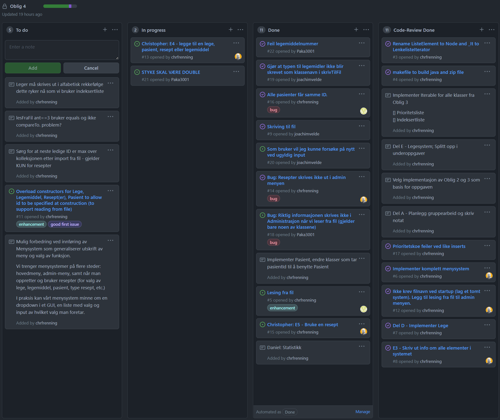

# IN1010 Oblig 4
Gruppe: chrifren, pakalonn, kjvelde, danistan

Innhold:

* Gruppearbeid
* Erfaringsnotat
* Merknader til retter

## Del A: Gruppearbeid 

### A1 + A2
Gruppeavtale - vi forventer at:

- Alle møter til avtalt tid, og hvis vi ikke får muligheten til dette skal vi si ifra til gruppa så fort som mulig 
- Alle tilbyr den hjelpen de kan og at det er lav terskel for å spørre om noe 
- Hvis noen føler at det blir for mye for dem, så skal de si fra til gruppa i god tid slik at vi kan delegere oppgavene 
- Arbeidsmengden fordeles relativt likt
- Alle skal være med å lage god stemming i gruppa og all kritikk skal være konstruktiv 
- Alle er ansvarlige for sluttproduktet og alle bidrar til å oppgaven blir ferdigstilt 

Vi har valgt å bruke Discord som plattform for å kommunisere innad i gruppa. Prosjektet blir delt på Github hvor alle kan se og redigere det andre gjør. Vi har valgt å dele oppgaven i begynnelsen og fordele ansvaret mellom de ulike delene. Vi har også valgt å møtes jevnlig for å diskutere koden sammen, og finne ut hvordan vi kan skrive koden for best integrasjon med de andre delene. Vi skal også hjelpe hverandre med underveis dersom det er noen som trenger det, og ønsker ogsåå å eksperimentere med litt forskjellige samarbeidsformer, f.eks. par-programmering, for å få et innblikk i hvilke arbeidsmetoder vi liker best.

Vi eksperimenterer med Projects i GitHub og issues som blir linket til commits, slik at vi kan spore kodeendringer ift oppgavene.

### A3

Vi har valgt å bruke de obligatoriske oppgavene til chrifren for å løse denne obligatoriske oppgaven. Fordelen med denne implementasjonen er at det er en dobbeltlenket liste som benyttes noe vi tror gjør det lettere å implementere visse funksjonaliteter i programmet vårt. Ulempen er at det kanskje gjør det mer tungvidt å programmere enkelte deler av programmet. Vi tror likevel av de positive sidene er større enn de negative, og dette er årsaken til at vi velger denne implementasjonen.

## Del F: Erfaringsnotat

### F1 _Hva gikk bra?_
Vi har lært mer om hvordan det er å samarbeide i grupper og har lært hvordan man kan bruke ulike verktøy for å samarbeide i slike prosjekter. Vi arbeidet sammen virtuelt, og hadde forskjellige tidspunkter tilgjengelig for å arbeide med oppgaven. Vi hadde korte samarbeidsmøter via Discord hvor vi planla arbeidet, og etterstrevde å jobbe agilt ved å legge opp oppgaver i GitHub projects, slik at de som hadde ledig tid kunne sette i gang med neste oppgave. Taskboardet vårt kan sees under.

{ width=500px }

Github og Discord fungerte veldig bra som kommunikasjonsplatformer. Vi utfordret oss selv og føler at sluttproduktet ble veldig bra. Vi var gode til å fordele oppgavene, slik at alle alltid hadde noe å gjøre.

Vi hadde enkelte sesjoner for å hjelpe hverandre både forstå oppgavene og for å teste og feilrette mangler.

Vi måtte ta noen valg basert på de datafilene som er lagt ved:

- Vi endret pris til double. Vi valgte å endre klassene til å benytte double for pris, selv om dette ikke er en ideell datatype for prisinformasjon.
- legedata_stor.txt inneholder styrke som double. Vi valgte å avrunde disse verdiene ved innlesing, som gjør at vi taper presisjon om filen lagres på nytt.

### F2 _Hva vil vi gjøre annerledes neste gang?_
Neste gang kan vi være flinkere til å sørge for at alle får den informasjonen de trenger fra begynnelsen av. Vi kunne kanskje også ha eksperimentert med litt ulike samarbeidsteknikker. Vi kunne også lagt bedre avtaler på hvordan vi skulle skrive kode, slik at vi ikke benyttet oss av forskjellige kodestiler og teknikker i programmet. Legesystem.java filen vår ble veldig stor i første runde av arbeidet, og dette skulle vi aller helst unngått ved å ha en mer systematisk tilnærming. Vi gjennomførte en ganske stor refactoring runde for å få delt opp i datalag, forretningslogikk og presentasjonslogikk (ui).

### F3 _Hva har vi fått ut av gruppearbeidet?_
Vi har lært mye av hverandre som ulike måter å angripe et problem på, og ulike måter å skrive kode på. Vi har blitt bedre kejnt med andre med ulik bakgrunn enn oss selv og har lært mye av hverandre. Det er også en fin anledning til å jobbe med et litt større prosjekt, og kanskje få et bedre innblikk i hvordan det er å arbeide som programmerer. Erfaring fra et virtuelt team er også nyttig da flere og flere selskaper har utviklere geografisk spredt.

### F4 _Hvordan kunne vi forbedret gruppearbeidet?_
Vi synes at vi hadde et veldig godt samarbeid. Ideelt sett hadde det vært ønskelig å møtes fysisk ved en anledning, men på grunn av forutsetningene våre var dette ikke mulig.

### Merknader til retter

Programmet kjøres gjennom Hovedprogram.java. Man kan laste en datafil gjennom argument på kommandolinjen, for eksempel "java Hovedprogram testdata.txt". I så tilfelle vil tillegg og endringer gjennom bruk av resepter skrives tilbake til denne filen når man avslutter programmet.

Man kan i tillegg laste og skrive til fil gjennom administrasjonsmenyen.

Vi har lagt de vanligste funksjonene (slik vi ser det) i hovedmenyen, mens opprettelse av leger og ledemidler ligger i administrasjonsmenyen. Vi ser for oss at et fullstendig system vil ha tilgangskontroll til både statistikk og admin menyen. I admin menyen finner man også funksjon for å skrive ut alle objekter i systemet.

Datalaget for import/eksport finnes i FilDataLag klassen. Forretningslogikken finnes hovedsakelig i Legesystem.java. Presentasjonslogikken finnes i diverse *UI klasser som fungerer som bindeledded mellom menyene, brukerinput og forretnings/datalag.

Det er enkelte funksjoner man ikke kan "komme seg ut av" uten å fullføre operasjonen med gyldig input. Vi har valgt å la dette bli som det er gitt at dette ikke er et reelt system og det ikke er mye læring i det ut over det vi allerde har gjort, selv om det ville vært uvurderlig i et produksjonsssystem.