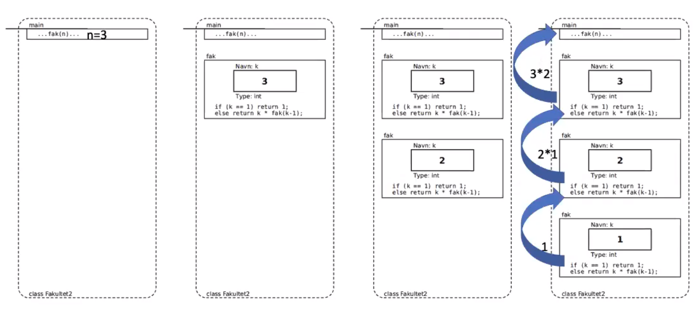

# Table of contents
- [Table of contents](#table-of-contents)
- [Rekursjon i Java](#rekursjon-i-java)
  - [Fakultet n!](#fakultet-n)
    - [Iterativ](#iterativ)
    - [Rekursjon](#rekursjon)

# Rekursjon i Java
- En rekursiv metode er en metode som kaller seg selv
- Nytting i mange tilfeller. Noen problemer er rekursive av natur (at problemet er selvrefererende).
- Alle rekursive algoritmer kan også programmeres uten rekursjon.
- Alle rekursive algoritmer har et basistilfelle som stopper rekursjonen, altså kall på seg selv.
- Det rekursive kallet må alltid være enklere enn forrige kall, dvs nærmere seg basistilfellet for hvert kall

## Fakultet n!
1! = 1\
2! = 1 * 2\
3! = 1 * 2 * 3\
n! = 1 * 2 * 3 ... n\


### Iterativ
```java
class Fakultet{
    static long fak(int k){
        long res = 1
        for (int i = 1 i <=k; i++){
            res = res*i;
        }
        return res;
    }

    public static void main(String[] arg){
        int n = Integer.parseInt(arg[0]);
        for(int i = 1; i <= n; i++){
            System.out.println(i + "!="+ fak(i))
        }
    }
}
```
### Rekursjon
- Dersom man ser på definisjonen av faklultetet ser man at det er et mønster som går igjen. Dvs 4! = 3! * 4
- Basistilfellet: 1! = 1
- Resterende: n! = n * (n-1)!
```java
class Fakultet{
    static long fak(int k){
        /*Basistilfellet, kalles også trivielt (enkelt) 
        * tilfellet som ikke er rekursivt*/
        if(k == 1) 
            return 1;

        /*Det rekursivet kallet
        * Det må være enklere enn det forrige kallet enn tidligere
        * Dvs du må nærme deg basistilfellet*/
        else 
            return k * fak(k-1); //fak(k-1) er et enklere kall
    }

    public static void main(String[] arg){
        int n = Integer.parseInt(arg[0]);
        for(int i = 1; i <= n; i++){
            System.out.println(i + " ! = "+ fak(i))
        }
    }
}
```
Visualisering av hvordan kjøring fra koden over blir når vi finner 3!:
