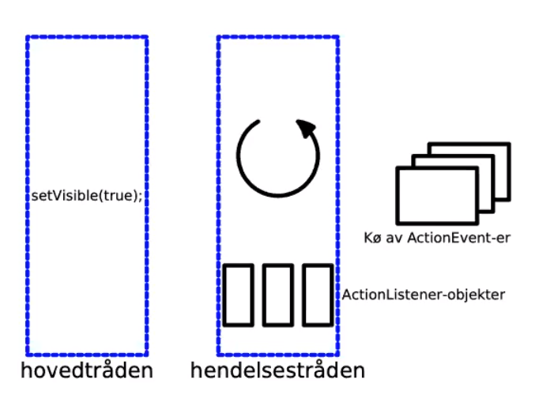
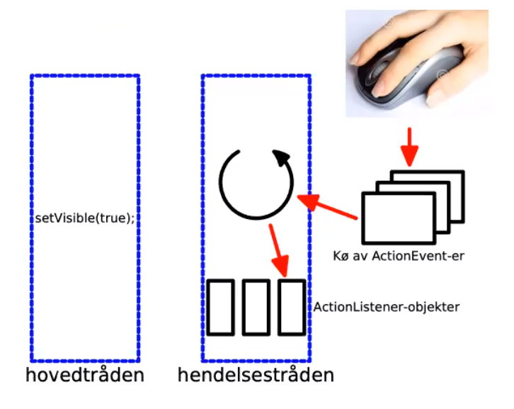
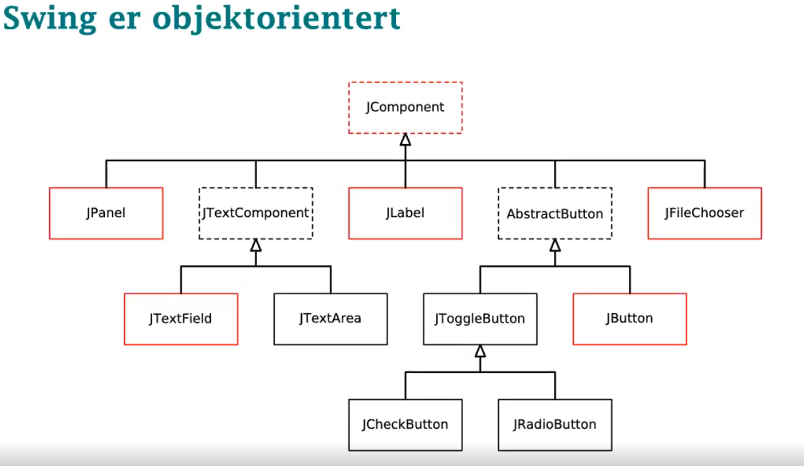
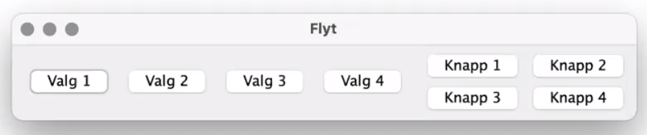
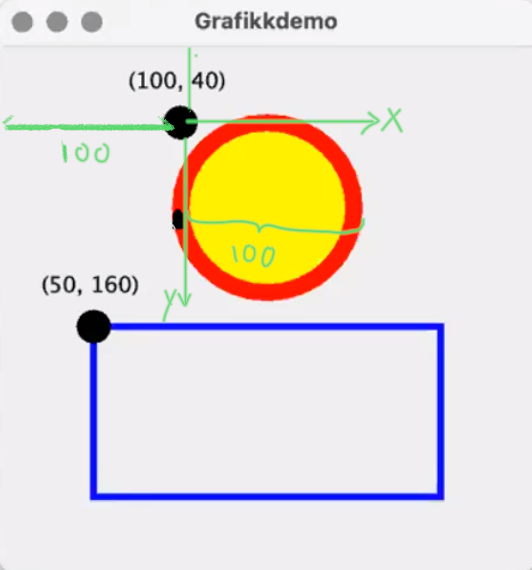
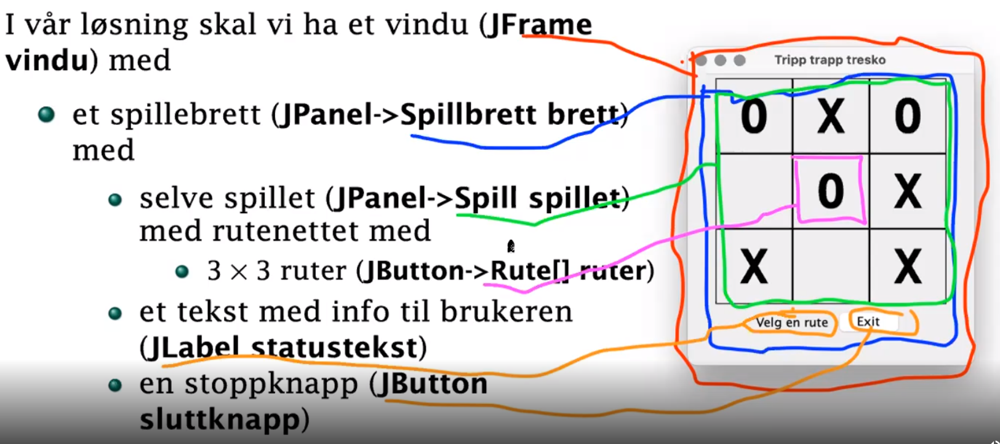
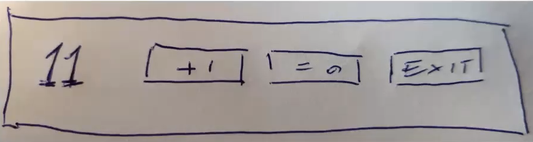

# Table of contents
- [Table of contents](#table-of-contents)
- [GUI "Graphical User Interface"](#gui-graphical-user-interface)
  - [Kjøring](#kjøring)
  - [Fordeler og ulemper med GUI-programmering](#fordeler-og-ulemper-med-gui-programmering)
  - [Design av GUI-programmer](#design-av-gui-programmer)
  - [Hvordan bygge et GUI-program etter design 1.](#hvordan-bygge-et-gui-program-etter-design-1)
- [Programmeringsparadigmer](#programmeringsparadigmer)
- [Hendelsesdrevet programmering](#hendelsesdrevet-programmering)
  - [Oppstart](#oppstart)
  - [Vente på hendelser](#vente-på-hendelser)
  - [Håndtere hendelser](#håndtere-hendelser)
  - [Hvorfor trenger vi en kø av ActionEventer-er](#hvorfor-trenger-vi-en-kø-av-actioneventer-er)
  - [Å ha to tråder innebærer følgende:](#å-ha-to-tråder-innebærer-følgende)
  - [Treg hendelseshåndtering](#treg-hendelseshåndtering)
- [Programmere GUI (AWT+Swing)](#programmere-gui-awtswing)
  - [Standard oppsett uten noe funksjonalitet](#standard-oppsett-uten-noe-funksjonalitet)
  - [Opprette trykknapper](#opprette-trykknapper)
  - [Tekst](#tekst)
  - [Filvelger](#filvelger)
  - [Layout](#layout)
  - [Farger](#farger)
  - [Font](#font)
  - [Rammer](#rammer)
  - [Tegning (Graphics2D)](#tegning-graphics2d)
    - [Eksempelkode](#eksempelkode)
- [Programeksempler](#programeksempler)
  - [Et minimalt GUI-program](#et-minimalt-gui-program)
  - [Et quizprogram](#et-quizprogram)
  - [Tripp-trapp-tresko](#tripp-trapp-tresko)
    - [Hva skal programmet gjøre](#hva-skal-programmet-gjøre)
    - [Rute](#rute)
    - [Spillbrettet](#spillbrettet)
    - [Spillet](#spillet)
    - [Hovedprogrammet](#hovedprogrammet)
  - [En teller](#en-teller)
# GUI "Graphical User Interface"  
- Et godt nettkurs som introduserer bruk av GUI, laget av [Oracle](https://docs.oracle.com/javase/tutorial/uiswing/ "nettkurs fra oracle").
- IN1010 bruker AWT+Swing i kurset fordi det er en del av standard Java
- JavaFX er mer moderne og avansert

## Kjøring
Grafiske programmer trenger mer støtte ved kjøring fra systemet enn tekstorienterte programmer. Det enkleste er å installere java på egen maskin.

## Fordeler og ulemper med GUI-programmering
Fordeler
- Mer intuitivt å bruke
- Færre muligheter for brukerfeil
- Visuelt mer tiltalende

Ulemper
- Mer komplisert å programmere
- Mange ulike GUI-biblioteker å velge mellom
- Svært få biblioteker som fungerer på tvers av Linux, Mac og Windows

## Design av GUI-programmer
Det er to hovedmåter å organisere GUI-program på:
1. Lag det grafiske bildet først og fyll på med kode
   - Ofte enklere å programmere og krever mindre kode
2. Utvikle "selve programmet" og GUI-presentasjonen hver for seg (MVC = Model-View-Controller)
   - Lettere å holde oversikten om "selve programmet" er komplisert
   - Lettere å tilpasse programmet til ulike medier (mobil, nettbrett osv.)

## Hvordan bygge et GUI-program etter design 1.
1. Finn ut **nøyaktig** hva programmet skal gjøre
2. Lag en håndtegning på papir av alle elementene
3. Skriv kode som genererer elementene
4. Lag EventHandler-klassene som angir hva som skal skje når brukeren trykker på knappen
5. Skriv resten av programmet

# Programmeringsparadigmer
Det finnes mange typer å programmere på, og disse kalles ofte **programmeringsparadigmer**.
- **Imperativ programmering** der utførelsen følger programflyten angitt av programmereren
  - Objektorientert programmering er en undergruppe der operasjonene er knyttet til objekter
- **Hendelsesdrevet programmering** "event-driven-programming der brukerens handlinger styrer programflyten
  - Typisk GUI-programmering

# Hendelsesdrevet programmering
Her ligger programmet passivt og venter på noe skal skje. F.eks kan det signaliseres ved at brukeren:
- trykker på en knapp på skjermen
- Flytter musen
- Trykker på en mustast
- Trykker på tastaturet
- slipper om en tast
- endrer størrelse på vinduet
- ...

## Oppstart
Programmet startes i metoden main i hovedtråden. Etter en stund kaller programmet:
```java 
vindu.setVisible(true) 
```
Det opprettes en ny tråd: hendelsestråden ("Event dispatch thread").

## Vente på hendelser
Så lenge køen er tom, ligger den passiv og venter på noe ska skje:



## Håndtere hendelser
Hver hendelse som inntreffer, resulteter i et *ActionEvent*-objekt i køen. Hendelsesløkken tar *ActionEvent*-ene etter tur og den korrekte *ActionListneren* vil bli kalt.



## Hvorfor trenger vi en kø av ActionEventer-er
Hendelsestråder kan bare ta sen av èn hendelse av gangen, men noen ganger kan flere hendelsr inntreffe omtrent samtidig. Da trenger vi køen for å ta vare på de hendelsene som venter på å bli tatt hånd om. 
  - Ingen hendelser må bli glemt
  - Hendelsene må håndteres i riktig rekkefølge

## Å ha to tråder innebærer følgende:
  - De to trådene går uavhenging av hverandre
  - Hovedtråden kan fortsette med sine egne ting uten å forstyrre eller bli forstyrret av hendelsestråden
  - Hovedtråden kan kommunisere med hendelsestråden ved å lage egne ActionEventer
    - Se SwingUtils.invokeLater
  - Selv om den ene tråden dør, lever den andre videre
    - Derfor er vindu.setDefaultCloseOperation(JFrame.EXIT_ON_FAILURE);
  - Kun én ActionListener kan jobbe av ganger; hvis den bruker lang tid virker, hendelseshåndteringen død

## Treg hendelseshåndtering
For å demonstere effekten av treg håndtering kan vi legge inn en venteløkke:
```java
class Reset implements ActionListener{
    @Override
    public void actionPerformed (ActionEvent e){
        tellerverdi = 0;
        ventAktivt(10); //10s venting
        antall.setText(" "+tellerverdi+ " ");
    }
}
```
En passende venteløkke
```java
static void ventAktivt(int n){
    //Kjør kode som tar omtrent n-sekunder
    for(int i = 1; i<=n; i++){
        long x = i;
        for (long j = 1; j <=250*1000*1000; j++){
            x = (3+j)*x % (1000*1000);
        }
    }
}
```

# Programmere GUI (AWT+Swing)
Swing er objektorientert. I IN1010 bruker vi det som er merket med rødt. JComponent er en sentral klasse, og alt som vi kan plassere på GUI vindu er en subklasse av denne. Det betyr også at vi kan definere farger, fonter o.l.

**TIPS FRA FORELESER**: Det lønner seg å unngå GUI-kode i konstruktørene. I stedet bør GUI-koden skilles ut og legges i en egen metode, feks initGUI().



På tegneflaten (JPanel-objekt) kan vi plassere ulike bokser:
- tekst (JLabel)
- trykknapper(JButton)
  - Hvis jeg ønsker å lagre noe informasjon inne i JButton (nye instansvariabler) lages den en subklasse om arver fra JButton
- tekstfelt (JTextField)
- tegneflater (JPanel), ny å mindre tegneflate på tegneflaten
- ...

## Standard oppsett uten noe funksjonalitet
```java
import java.awt.*;
import java.awt.event.*;
import javax.swing.*;

class Hallo{
    public static void main(String[] arg){
        JFrame vindu = new JFrame("Hei");
        vindu.setDefaultCloseOperation(JFrame.EXIT_ON_CLOSE);

        JPanel panel = new JPanel();
        vindu.add(panel);

        //Vi ber java om brukernavnet til den som kjører programmet
        String bruker = System.getProperty("user.name");

        //Oppretter en ny JLabel og legger den til på vårt panel.
        JLabel hilsen = new JLabel("Hallo, "+bruker+"!");
        panel.add(hilsen)

        vindu.pack();
        vindu.setVisible(true);
    }
}
```
## Opprette trykknapper
Den vanligste formen for interaksjon med en bruker er trykknapper. 
1. Opprett trykknappen (JButton)
2. sette den på en tegneflate (JPanel)
3. skrive kode som skal utføres ved et trykk (ActionListener)
4. koble koden til trykknappen (addActionListener)

Lager et testprogram som stopper av seg selv:

```java
import java.awt.*;
import java.awt.event.*;
import javax.swing.*;

class Exit{
    public static void main(String[] arg){
        //Standard
        JFrame vindu = new JFrame("Hei");
        vindu.setDefaultCloseOperation(JFrame.EXIT_ON_CLOSE);
        JPanel panel = new JPanel();
        vindu.add(panel);

        //Oppretter knappen
        JButton exitKnapp = new JButton("Exit");

        //Oppretter en ny klasse som implementerer et interface ActionListener
        //Det eneste som kreves er at vi oppretter en ActionPerformed. 
        //(ActionEvent e) må være med som parameter, men kan egentlig ignoreres
        //Deretter må programmere hva vi ønsker at knappen skal utføre.
        class Stopper implements ActionListener{
            @Override
            public void actionPerformed (ActionEvent e){
                System.exit(0);
            }
        }

        //Kobler sammen knapp og kode
        exitKnapp.addActionListener(new Stopper());
        //Plasserer knappen på tegneflaten
        panel.add(exitKnapp);

        //Standard
        vindu.pack();
        vindu.setVisible(true);
    }
}
```
## Tekst
Ofte er det ønskelig å motta tekst fra brukeren. Til dette brukes JTextField der man angir initiell tekst og bredde. Brukeren kan redigere denne teksten, og programmet kan lese og skrive med metodene **getText** og **setText**.

```java
JTextField tekst = new JTextField("Skriv en tekst:", 30);
```

## Filvelger

Oppretter en fil, hovedstad-belgia.txt, på følgende format:
```
Paris
Amsterdam
*Brussel
Luxembourg
```
Deretter må vi lese en fil. Den åpner en mappestruktur der man kan velge filen.
```java
//Oppretter filvelger
JFileChooser velger = new JFileChooser();

//Åpner dialogvindu
int resultat = velger.showOpenDialog(null);

//Dersom alt går bra er resultat lik denne konstanten
if(resultat == JFileChooser.APPROVE_OPTION)
    File f = velger.getSelectedFile();
else
    //Avslutter programmet
```

## Layout
Hvordan plassere elementer, standard er **FlowLayout**. Den er fleksibel og bytter linje ved behov. Noen ganger fortrekker man **GridLayour**, som er et rutenett. I IN1010 skal vi kun bruke FlowLayout og rutenett.

```java
//FlowLayout
JPanel flyt = new JPanel();
flyt.add(new JButton("Valg 1"));
flyt.add(new JButton("Valg 2"));
flyt.add(new JButton("Valg 3"));
flyt.add(new JButton("Valg 4"));
panel.add(flyt)

//Rutenett
JPanel ruter = new JPanel();
ruter.setLayout(new GridLayout(2,2)); //Angir rader og kolonner
ruter.add(new JButton("Knapp 1"));
ruter.add(new JButton("Knapp 2"));
ruter.add(new JButton("Knapp 3"));
ruter.add(new JButton("Knapp 4"));
panel.add(ruter)
```
Produserer følgende:\



## Farger
Farges lages med new Color(r,g,b) men noen farger er også predefinert:
- BLACK, BLUE, CYAN, DARK_GRAY, GRAY, GREEN, LIGHT_GRAY, MAGENTA, ORANGE, PINK, RED, WHITE, YELLOW

Vi kan sette fager på subklasser av JComponent. Foreground er fargen på teksten vi skriver, Background er bakgrunnsfargen i elementet. Bakgrunnsfargen til JButton er dårlig implementert, så det kan være en utfordring å endre bakgrunnsfargen. Endre heller Foreground-fargen.
```java
xxx.setForeground(Color.BLUE);
xxx.setBackground(Color.GREEN);
xxx.setForeground(new Color (218, 41, 28)) // new Color(R, G, B);
```

## Font
```java
new Font(Font.MONOSPACED, Font.PLAIN, 30); //30 = antall skjermpiksler
new Font(Font.MONOSPACED, Font.BOLD, 30);
new Font(Font.SANS_SERIF, Font.BOLD, 30);
```

## Rammer
Det finnes ca 15 rammer og velge mellom.
```java
setBorder(BorderFactory.createLineBorder(Color.BLACK))
```
## Tegning (Graphics2D)
For å lage tegninger må man bruke mekanismer i AWT, men ikke i Swing. Det gjøres ved å lage vår egen **JComponent**. Enheten vi bruker er alltid **piksler**.
  - **Koordinatsystemet** er definert med at positiv y-akse går nedover, x-retning er som vanlig.
  - **Referansepunktet** for sirkler, rektangler osv er alltid øvre venstre hjørne.
```java
class GPanel extends JComponent{
    GPanel(){
        //Panelet vi skal tegne i er 300x300
        setPreferredSize(new Dimension(300,300));
    }

    @Override
    public void paintComponent (Graphics g){
        //Redefinerer selve tegnekomponenten i Swing systemet.
        //(Graphics g) er en peker til en datastruktur som representerer hele det grafiske bildet
        super.paintComponent(g); //Forsikrer at paintCompontent gjør alt som er nødvendig for en JComponent

        //For å lage 2D tegninger
        //g2 er det objektet vi skal bruke for å tegne
        Graphics2D g2 = (Graphics2D) g;
    }
}
```
### Eksempelkode
```java
class GPanel extends JComponent{
    GPanel(){
        setPreferredSize(new Dimension(300,300));
    }

    @Override
    public void paintComponent (Graphics g){
        super.paintComponent(g);
        Graphics2D g2 = (Graphics2D) g;
        
        //Oppretter sirkel
        g2.setColor(Color.YELLOW); //Setter standardkode til gul, dvs alt jeg tegner blir gult
        g2.fillOval(100,40, 100,100); //100x40 (startposisjonen) 100x100 (diameter til sirkel, bredde x høyde)
        g2.setColor(Color.RED);
        g2.setStroke(new BasicStroke(10));
        g2.drawOval(100,40, 100,100);

        //Opppretter rektangel
        g2.setColor(Color.BLUE);
        g2.setStroke(new BasicStroke(4));
        g2.drawRect(50,160, 200,100);
}
```

```java
import java.awt.*;
import java.awt.event.*;
import javax.swing.*;

class Grafikkdemo{
    public static void main(String[] arg){
        JFrame vindu = new JFrame("Grafikkdemo");
        vindu.setDefaultCloseOperation(JFrame.EXIT_ON_CLOSE);
        JPanel panel = new JPanel();
        vindu.add(panel);

        panel.add(new GPanel());

        vindu.pack();
        vindu.setVisible(true);
    }
}
```
Produserer følgende figurer:\


# Programeksempler
Nedenfor er det noen eksempler fra forelesning.
## Et minimalt GUI-program
Dette programmet vil gi et standard vindu med minimer-, maksimer- og lukk-knapper
```java
//Disse er all import vi trenger i IN1010
import java.awt.*;
import java.awt.event.*; //event er ingen klasse, men en pakke. Derfor må den implisitt importeres.
import javax.swing.*;

class Mini{
    public static void main(String[] args){
        //Deklarerer selve vinduet, "Xxx" er navnet som står i vinduet
        JFrame vindu = new JFrame("Xxx");
        //Vi må bestemme hva som skjer når vi trykker på lukk-knappen
        //Dersom du ikke gjør det vil tråden fortsatt leve etter lukking
        vindu.setDefaultCloseOperation(JFrame.EXIT_ON_CLOSE);

        //Oppretter tegneflaten som vi kan jobbe på og legger inn i vinduet.
        JPanel panel = new JPanel();
        vindu.add(panel);

        //Alt vi ønsket å ha inn i vinduet skal dyttes pent sammen. Det gjøres med .pack(). Deretter gjør vi vinduet synlig.
        vindu.pack();
        vindu.setVisible(true);
    }
}
```

## Et quizprogram

1. Programmet ber brukeren om navnet på en oppgavefil
2. Programmet leser filen og oppretter et GUI-vindu med spørsmålet og 4 trykknapper med svar-alternativer plassert i en 2x3 mønster
3. Hvis brukerer velger korrekt alternativ endres teksten på trykknappen til **OK**
4. Ved feil blir teksten på trykknappen forandret til **Nei**

Filen er definert på følgende måte:
```
Paris
Amsterdam
*Brussel
Luxembourg
```
Hele programmet:
```java
import java.awt.*;
import java.awt.event.*;
import javax.swing.*;

import java.io.*;
import java.util.Scanner;

class Quiz{
    public static void main(String[] arg){
        //Henter fil
       JFileChooser velger = new JFileChooser();
       int res = velger.showOpenDialog(null);
       if(res != JFileChooser.APPROVE_OPTION){
           System.exit(1);
       }
       File f = velger.getSelectedFile();
       Scanner leser = null;

       try{
           leser = new Scanner(f);
       }catch(FileNotFoundException e){
           System.exit(1);
       }

       //Oppretter GUI-vindu
        JFrame vindu = new JFrame("Hei");
        vindu.setDefaultCloseOperation(JFrame.EXIT_ON_CLOSE);
        JPanel panel = new JPanel();
        vindu.add(panel);

        //Leser spørsmålet
        JLabel question = new JLabel(leser.nextLine());
        panel.add(question); 

        //Oppretter 4 alternativerknapper som plasseres på sin egen 2x2-flate
        static Svar[] svar = new Svar(4); //Se klassen nedenfor

        JPanel alternativer = new JPanel();
        alternativer.setLayout(new GridLayout(2,2));
        for(int i = 0; i < 4; i++){
            String s = leser.nextLine();
            if(s.startsWith("*"))
                svar[i] = new Svar(s.substring(1),true);
            else
                svar[i] = new Svar(s, false);
            svar[i].initGUI();
            alternativer.add(svar[i]);
        }
        panel.add(alternativer);


        //Pakker alt sammen og viser vinduet
        vindu.pack();
        vindu.setVisible(true);
    }
}
```
Oppretter en egen klasse som binder sammen svar og knapper.
```java
class Svar extends JButton{
    String svar;
    boolean riktig;

    Svar(String s, boolean r){
        super(s);
        svar = s;
        riktig = r;
    }

    class Velger implements ActionListener{
        @Override
        public void actionPerformed (ActionEvent e){
            if(riktig)
                setText("OK");
            else
                setText("NEI");
        }
    }

    //Det er lurt å installere GUI i en egen metode som kalles etter selve objekter er laget
    void initGUI(){
        addActionListiner(new Velger());
    }
}
```
## Tripp-trapp-tresko
Skal lage et tripp-trapp-tresko etter [designmetode 1](#design-av-gui-programmer).

GUI-oppsettet skal være som følgende:
1. Et vindu(JFrame vindu)
   1. Et spillbrett (JPanel -> Spillbrett brett)
      1. Selve spillet(JPanel -> Spill spillet)
         1. 3x3 rutenett (JButton -> Rute[] ruter)
      2. Tekst med info til bruker (JLabel statustekst)
      3. Stoppknapp (JButton sluttknapp)



### Hva skal programmet gjøre
1. Hver rute på 3x3 brettet skal være klikkbart
   1. Opprette en subklasse Rute fordi vi ønsker å lagre et merke i hvert rute
   2. merkene er: " ", "X", "O".
2. Ved hvert klikk skal programmet
   1. Sjekke om trekket er lovlig
   2. vise brukerens trekk
   3. sjekke om brukeren har vunnet
   4. beregne og vise maskinens trekk
   5. sjekke om maskinen har vunnet/uavgjort

### Rute
```java 
class Rute extends JButton{
    Spill spillet;
    char merke = " ";

    Rute (Spill s){
        spillet = s;
    }

    void initGUI(){
        setBorder(BorderFactory.createLineBorder(Color.black));
        setFont(new Font("Monospaced", Font.BOLD, 50));
        setPrefrerredSize(new Dimension(80,80));
        setText(" ");

        //Gjøre ruten klikkbar
        Rute denneRuten = this;
        class Rutevelger implements ActionListener{
            @Override
            public void actionPerformed (ActionEvent e){
                if(! spillet.ferdig){
                    spillet.spillO(denneRuten);
                }
            }
        }
        addActionListener(new Rutevelger());
    }
    void settMerke(char c){
        setText(""+c);
        merke = c;
    }
}
```

### Spillbrettet
```java 
class Spillbrett extends JPanel{}
    JButton sluttknapp; 
    JLabel statustekst; 
    Spill spillet;

    //Sørger for at spillet initieres
    Spillbrett(){
        spillet = new Spill(this);
    }


    void initGUI(){
        spillet.initGUI();
        //Legger til i Spillbrett
        add(spillet);
        
        statustekst = new JLabel("Velg en rute");
        add(statustekst);

        sluttknapp = new JButton("Exit");

        class Stoppbehandler implements ActionListener{
            @Override
            public void actionPerformed (ActionEvent e){
                System.exit(0);
            }
        }
        sluttknapp.addActionListener(new Stoppbehandler());
        add(sluttknapp);
    }
}
```

### Spillet
```java
class Spill extends JPanel{
    Spillbrett brettet;
    Rute ruter[] new Rute[9+1];
    boolean ferdig = false;

    Spill (Spillbrett b){
        brettet = b;
        //Lager alle 9 ruter
        for (int i = 1; i <= 9; i++){
            ruter[i] = new Rute(this);
        }
    }

    void initGUI(){
        setLayout(new GridLayout(3,3));

        for(int i = 1; i <= 9; i++){
            ruter[i].initGUI();
            add(ruter[i]);
        }
    }

    //Brukeren
    void spillO (Rute r){
        if (r.merke != " "){
            brettet.statustekst.setText("Opptatt");
            return;
        }
        r.settmerke("O");
        if(harVunnet("O"))
            utropVinner("O");
        else if (erUavgjort())
            utropUavgjort();
        
        if(!ferdig)
            brettet.statustekst.setText("Velg en rute");
            spillX();
    }

    //Maskinen
    Random tilfeldig = new Random();
    
    void spillX(){
        int p;
        do{
            p = tilfeldig.nextInt(9)+1;
        } while (ruter[p].merke != " ");
        ruter[p].settMerke("X");

        if (harVunnet("X"))
            utropVinner("X");
        else if (erUavgjort())
            utropUavgjort();    
    }

    //Definer hjelpemetodene harVunnet, erUavgjort, utropVinner og utropUavgjort
}
```

### Hovedprogrammet
```java
import java.awt.*;
import java.awt.event.*;
import javax.swing.*;

import java.util.Random;

class TTTGUI{
    public static void main(String[] arg){
        JFrame vindu = new JFrame("Tripp trapp tresko");
        vindu.setDefaultCloseOperation(JFrame.EXIT_ON_CLOSE);
        Spillbrett brett = new Spillbrett();
        brett.initGUI();
        vindu.add(brett);

        vindu.pack();
        vindu.setVisible(true);

        //Starter spillet på en tilfeldig verdi
        brett.spillet.spillX();
    }
}
```

## En teller
1. Hva skal den gjøre?
   - Vise antall trykk
   - For hvert trykk skal antallet øke med 1
   - Knapp for nullstilling

2. Håndtegning
    

3. Kode som lager telleren
    ```java
    //Tellerverdi
    JLabel antall = new JLabel(" 0 ");
    static int tellerverdi = 0; //Brukes for å oppdatere hvor langt teller er kommet
    ```
     ```java
    //Telleren
    JButton tell = new JButton(" +1 ");
    ```
    ```java
    //Nullstilleren
    JButton reset = new JButton(" =0 ");
    ```
    ```java
    //Avslutteren
    JButton slutt = new JButton(" Exit ");
    ```
4. Hva skjer ved museklikk? **EventHandler**. Vi må opprette en klasse,
   ```java
    //Telleren
    class IncreaseCount implements ActionListener{
        @Override
        public void actionPerformed (ActionEvent e){
            ++tellerverdi;
            antall.setText(" "+tellerverdi+ " ");
        }
    }
    tell.addActionListener(new IncreaseCount());
    ```
    ```java
    //Nullstilleren
    class Reset implements ActionListener{
        @Override
        public void actionPerformed (ActionEvent e){
            tellerverdi = 0;
            antall.setText(" "+tellerverdi+ " ");
        }
    }
    reset.addActionListener(new IncreaseCount());
    ```
     ```java
    //Avslutteren
    class Exit implements ActionListener{
        @Override
        public void actionPerformed (ActionEvent e){
            System.exit(0)
        }
    }
    reset.addActionListener(new IncreaseCount());
    ```
5. Skrive hele programmet
    ```java
    import java.awt.*;
    import java.awt.event.*;
    import javax.swing.*;

    class Teller {
        static int telleverdi = 0;

        public static void main(String[] arg){
            //Oppretter vindu
            JFrame vindu = new JFrame("Teller");
            vindu.setDefaultCloseOperation(JFrame.EXIT_ON_CLOSE);
            JPanel panel = new JPanel();
            vindu.add(panel);

            JLabel antall = new JLabel(" 0 ");

            //Oppretter Telleren knappen
            JButton tell = new JButton(" +1 ");
            class IncreaseCount implements ActionListener{
                @Override
                public void actionPerformed (ActionEvent e){
                    ++tellerverdi;
                    antall.setText(" "+tellerverdi+ " ");
                }
            }
            tell.addActionListener(new IncreaseCount());
        
            //Oppretter Nullstilleren knappen
            JButton reset = new JButton(" =0 ");
            class Reset implements ActionListener{
                @Override
                public void actionPerformed (ActionEvent e){
                    tellerverdi = 0;
                    antall.setText(" "+tellerverdi+ " ");
                }
            }
            reset.addActionListener(new Reset());   

            //Oppretter Avslutteren knappen
            JButton slutt = new JButton(" Exit ");
            class Exit implements ActionListener{
                @Override
                public void actionPerformed (ActionEvent e){
                    System.exit(0)
                }
            }
            slutt.addActionListener(new Exit());    
            
            //Legger knappene til panelet i den rekkefølgen som er listet
            panel.add(antall);
            panel.add(tell);
            panel.add(reset);
            panel.add(slutt);

            //Pakker vindu og gjør synlig
            vindu.pack();
            vindu.setVisible();
        }
    }
    ```


