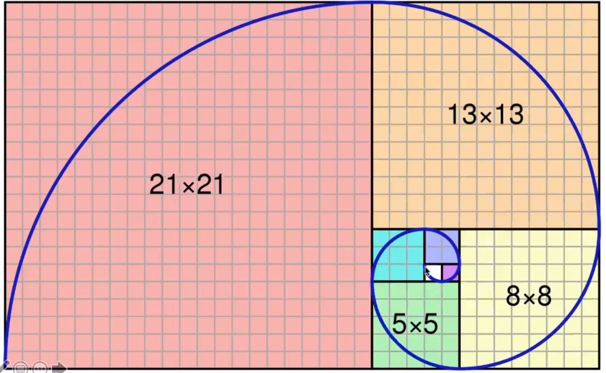
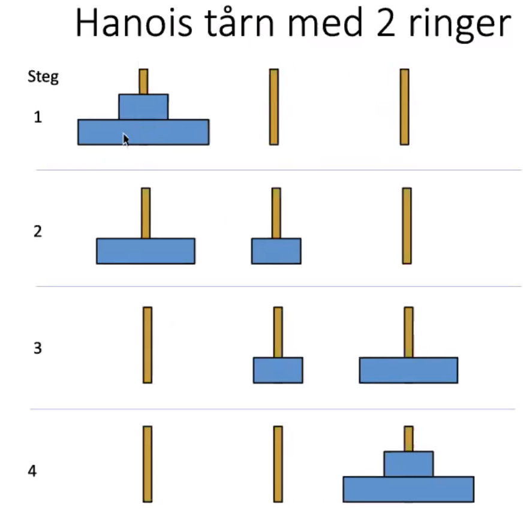
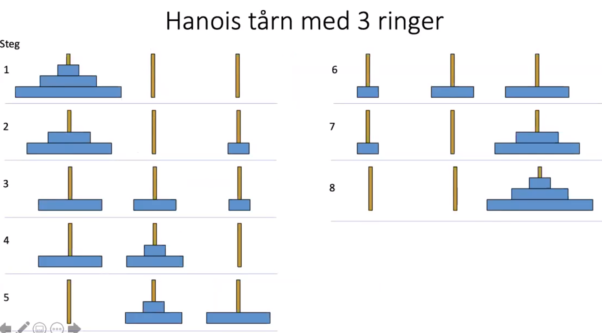

# Table of contents
- [Table of contents](#table-of-contents)
- [Rekursjon i Java](#rekursjon-i-java)
  - [Hvordan løse rekursive problemer](#hvordan-løse-rekursive-problemer)
- [Fakultet n!](#fakultet-n)
  - [Iterativ](#iterativ)
  - [Rekursjon](#rekursjon)
- [Fibonacci-sekvensen](#fibonacci-sekvensen)
  - [Kanin eksempel](#kanin-eksempel)
  - [Fibonacci java-kode](#fibonacci-java-kode)
- [Hanois tårn](#hanois-tårn)
  - [Programmere Hanois trån](#programmere-hanois-trån)
- [Enveis lenkene lister](#enveis-lenkene-lister)
  - [Java kode](#java-kode)

# Rekursjon i Java
- En rekursiv metode er en metode som **kaller seg selv**
- Nytting i mange tilfeller. Noen problemer er rekursive av natur (at problemet er selvrefererende).
- Alle rekursive algoritmer kan også programmeres uten rekursjon.
- Alle rekursive algoritmer har et **basistilfelle** som stopper rekursjonen, altså kall på seg selv.
- Det rekursive kallet må alltid være **enklere enn forrige kall**, dvs nærmere seg basistilfellet for hvert kall

## Hvordan løse rekursive problemer
- Dersom problemet er enkelt, løs det med en gang
  - Eks: Fibonacci
- Hvis ikke, prøv å reduser problemet til en enklere variant av samme problem
  - Eks: gjøre input mindre, 
    - trekke fra et tall -> statid minker.
    - Fjerne et element fra listen -> går alltid videre
- Av og til kan det å tenke at *Noen Andre* løser den enklere varianten av problemet
- Det største "trikset" med rekursjon er å løse det enkle problemet og redusere vanskelige problemer til enkle problemer stegvis

# Fakultet n!
1! = 1\
2! = 1 * 2\
3! = 1 * 2 * 3\
n! = 1 * 2 * 3 ... n


## Iterativ
```java
class Fakultet{
    static long fak(int k){
        long res = 1
        for (int i = 1 i <=k; i++){
            res = res*i;
        }
        return res;
    }

    public static void main(String[] arg){
        int n = Integer.parseInt(arg[0]);
        for(int i = 1; i <= n; i++){
            System.out.println(i + "!="+ fak(i))
        }
    }
}
```
## Rekursjon
- Dersom man ser på definisjonen av faklultetet ser man at det er et mønster som går igjen. Dvs 4! = 3! * 4
- Basistilfellet: 1! = 1
- Resterende: n! = n * (n-1)!
```java
class Fakultet{
    static long fak(int k){
        /*Basistilfellet, kalles også trivielt (enkelt) 
        * tilfellet som ikke er rekursivt*/
        if(k == 1) 
            return 1;

        /*Det rekursivet kallet
        * Det må være enklere enn det forrige kallet enn tidligere
        * Dvs du må nærme deg basistilfellet*/
        else 
            return k * fak(k-1); //fak(k-1) er et enklere kall
    }

    public static void main(String[] arg){
        int n = Integer.parseInt(arg[0]);
        for(int i = 1; i <= n; i++){
            System.out.println(i + " ! = "+ fak(i))
        }
    }
}
```
Visualisering av hvordan kjøring fra koden over blir når vi finner 3!:


# Fibonacci-sekvensen
- Hvert tall er summen av de **to foregående tall**
- Tallrekken: 1, 1, 2, 3, 5, 8, 13, 21, 34, 55




## Kanin eksempel
Hvor mange kaninpar vil det finnes i en gitt måned, dersom:
- Kaniner blir kjønnsmodne etter en måned
- Hvert kjønnsmodent par føder et nytt par hver måned
- Kaniner lever evig


## Fibonacci java-kode
- F_n = F_(n-1) + F_(n-2) der F_1 = 1


Denne koden har et problem. Problemet oppstår i kallet fib(2) som kaller på fib(1) og fib(0). Vi har ingen håndtering for fib(0). Basistilfellet må endres.
```java
class nonWorkingFibonacci{
    static int fib(int n){
        //Basistilfellet. 
        //Vil fungere dersom vi sier n<=1, som håndterer fib(0).
        if(n==1)
            return 1;
        else
            //Rekursivt kall
            return fib(n - 1) + fib(n - 2);
    }

    public static void main(String[] arg){
        int antall = Integer.parseInt(arg[0]);
        for(int i = 1; i <= antall; i++){
            System.out.println("Fib(" + i +") = "+ fib(i)));
        }
    }
}
```
# Hanois tårn
I et tempel i Hanoi står står tre stolper. På den venstre ligger 64 ringer av ulik størrelse, sortert med den minste øverst. Munkene ved tenpelet skal flytte alle ringne fra venstre til den høyre, etter følgende regler
- Ringene må flyttes en og en
- En rin kan aldri legges oppå en mindre ring
- Man kan bruke den midtre stolpen til "mellomlagring" underveis





## Programmere Hanois trån
- Vi kaller de tre stolpene for **A**, **B**, **C**.
- Vi skal flytte alle ringene fra A til C
- For å kunne flytte den største ringen, må vi først flytte alle de andre ringene til hjelpestolpen B
- Så kan vi flytte den største ringen fra A til C
- Etterpå må vi flytte alle ringene fra hjelpestolpen B til C (oppå den største tingen)

```java
class Hanoi{
    static void flytt(int n, char fra, char via, char til){
        //Basistilfellet: Flytt 1 ring direkte
        if (n == 1){
            System.out.println("Flytt " + fra + " til " +til);
        }else{
            //Rekursivet kallet

            //Flytt de små ringene til hjelpestolpen:
            flytt(n - 1, fra, til via);
            //Flytt den største ringen fra 'fra'-stolpen til 'til'-stolpen:
            flytt(1, fra, via, til);
            //Flytt ringene fra hjelpestolpen til 'til'-stolpen igjen:
            flytt(n - 1, via, fra, til);
        }
    }
    public static void main(String[] arg){
        int antall = Integer.parseInt(arg[0]);
        flytt(antall, 'A', 'B', 'C');
    }
}
```

Eksempelkjøring:


# Enveis lenkene lister
Vi skal skrive en metode **reverse** som reversere en enkelt lenket liste

<p float="left">


</p>


## Java kode
```java
Class Lenkeliste<T> implements Liste<T>{
    Node start = null;

    class Node{
        Node neste = null;
        T data;

        Node(T x){
            data = x;
        }
    }

    void reverse(Node pre){
        //Basistilfellet:
        //dersom neste er null, er vi på slutten av listen som skal snus
        //og starten blir dermed denne noden.
        if (neste == null)
            start = this;
        else
            //Rekursivt kall:
            //ellers reverserer vi lista rekursivt:
            neste.reverse(this);
        //neste node er den som tidligere var før oss i kjeden
        neste = pre;
    }
}
```
